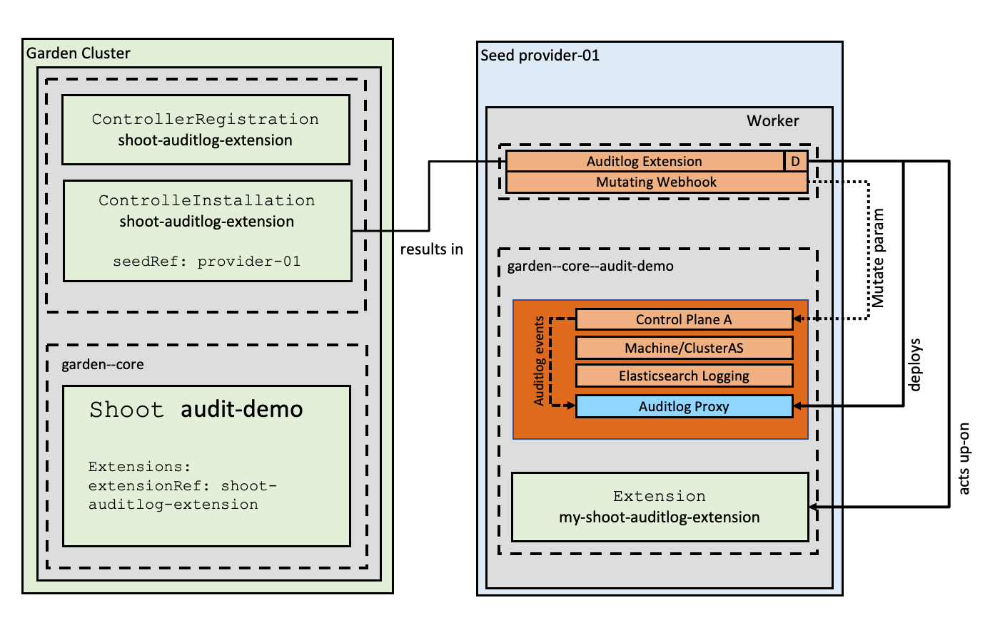

# [Gardener Extension for auditlogs](https://gardener.cloud)

:warning: This is no production ready implementation. Only use this for demo purposes. :warning:

Project Gardener implements the automated management and operation of [Kubernetes](https://kubernetes.io/) clusters as a service. Its main principle is to leverage Kubernetes concepts for all of its tasks.

Recently, most of the vendor specific logic has been developed [in-tree](https://github.com/gardener/gardener). However, the project has grown to a size where it is very hard to extend, maintain, and test. With [GEP-1](https://github.com/gardener/gardener/blob/master/docs/proposals/01-extensibility.md) we have proposed how the architecture can be changed in a way to support external controllers that contain their very own vendor specifics. This way, we can keep Gardener core clean and independent.

This extension extends the default gardener installation to store auditlogs.
A shoot can be configured to send its auditlog data to a specific endpoint or 
store the auditlog directly in one of the supported providers.

Therefore the auditlog extension consists of the extension controller which 
- acts upon the auditlog extensions 
- configures the apiserver
- and deploys the auditlog proxy

The auditlog proxy is the other component which is included in this repo.
It 
- receives all auditlog events from the apiserver and 
- stores them in one of the configured providers 
- or redirect the webhook to another service.



## Extension-Resources

Example extension resource:

```yaml
apiVersion: extensions.gardener.cloud/v1alpha1
kind: Extension
metadata:
  name: "shoot-auditlog-service"
  namespace: shoot--project--abc
spec:
  type: shoot-auditlog-service
  providerConfig:
    apiVersion: service.auditlog.extensions.config.gardener.cloud/v1alpha1
    backendProvider: elasticsearch # currently only elasticsearch is supported 
    backendProviderConfig: # the gardener internal logging elasticserach is reused if the endpoint omitted
      index: auditlogs
      endpoint: https://my-es-com:9200
      username: xxx
      password: xxx
    kind: Configuration
    policy:
      apiVersion: audit.k8s.io/v1
      kind: Policy
```

When an extension resource is reconciled, the extension controller will create an instance of [Cert-Management](https://github.com/gardener/cert-management) as well as an `Issuer` with the ACME information provided in the [configuration](#Configuration) above. These resources are placed inside the shoot namespace on the seed. Also, the controller takes care about generating necessary `RBAC` resources for the seed as well as for the shoot.

Please note, this extension controller relies on the [Gardener-Resource-Manager](https://github.com/gardener/gardener-resource-manager) to deploy k8s resources to seed and shoot clusters, i.e. it never deploys them directly.

## Auditlog Proxy
Example configuration for the proxy:
```yaml
apiVersion: proxy.shoot-auditlog-service.extensions.config.gardener.cloud/v1alpha1
kind: Configuration

provider: elasticsearch
providerConfig: {
  "endpoint":"http://elasticsearch-logging:9200",
  "index":"auditlogs",
  "password":"abc", 
  "username":"admin"
}

webhookConfiguration:
  httpsPort: 0
  httpPort: 8080

  tls:
    certFile: /path/tls.crt
    keyFile: /path/tls.key
```

## Provider

### Elasticsearch
The elasticsearch provider stores the received auditlogs in the configured elastic serach instance.

The extensions automatically uses the logging elastic search instance if no explicit elasticserach db is provided.
In addition, a grafana that shows the received auditlogs is deployed into the namespace.

## How to start using or developing this extension controller locally

You can run the controller locally on your machine by executing `make start`. Please make sure to have the kubeconfig to the cluster you want to connect to ready in the `./dev/kubeconfig` file.
Static code checks and tests can be executed by running `VERIFY=true make all`. We are using Go modules for Golang package dependency management and [Ginkgo](https://github.com/onsi/ginkgo)/[Gomega](https://github.com/onsi/gomega) for testing.

## Feedback and Support

Feedback and contributions are always welcome. Please report bugs or suggestions as [GitHub issues](https://github.com/gardener/gardener-extension-shoot-cert-service/issues) or join our [Slack channel #gardener](https://kubernetes.slack.com/messages/gardener) (please invite yourself to the Kubernetes workspace [here](http://slack.k8s.io)).

## Learn more!

Please find further resources about out project here:

* [Our landing page gardener.cloud](https://gardener.cloud/)
* ["Gardener, the Kubernetes Botanist" blog on kubernetes.io](https://kubernetes.io/blog/2018/05/17/gardener/)
* ["Gardener Project Update" blog on kubernetes.io](https://kubernetes.io/blog/2019/12/02/gardener-project-update/)
* [GEP-1 (Gardener Enhancement Proposal) on extensibility](https://github.com/gardener/gardener/blob/master/docs/proposals/01-extensibility.md)
* [Extensibility API documentation](https://github.com/gardener/gardener/tree/master/docs/extensions)
